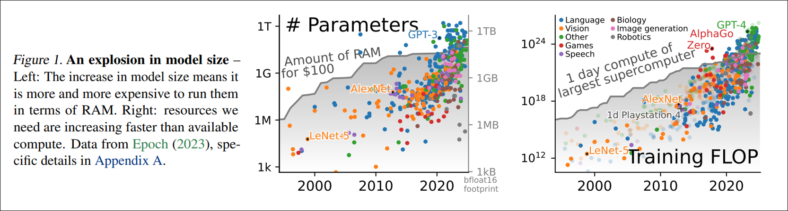

<div align="center">
<a href="https://github.com/Supercip971/by-human">
<picture>
  <source media="(prefers-color-scheme: dark)" srcset="https://raw.githubusercontent.com/Supercip971/by-human/main/transparent-light.svg">
  <source media="(prefers-color-scheme: light)" srcset="https://raw.githubusercontent.com/Supercip971/by-human/main/transparent-dark.svg">
  
</picture>

</a>
<h1>Made by Human, not by Gen-AI</h1>

[Website](https://www.by-human.net) | [Github](https://github.com/Supercip971/by-human) | [CC0 Licensed](https://github.com/Supercip971/by-human/blob/main/LICENSE)
</div>

This is a repository that aims to provide a **collection of badges to symbolize** that you didn't use generative AI (aka LLMs) for the creation of your project. By using this, we expect that the number of written lines of code by AI is less than 1% of your total number of written lines of code in your project. 

Note that nobody will check your code, and if you are against AI use in your codebase but are not sure about the number of lines of code written by AI, you can still use the badge. The goal is to be transparent and to try to reduce the abusive use of AI in codebases.

This repository is accompanied by an explanation that tries to be backed by **scientific research** to support every claim. But this part **is still a work in progress**.

# Badge usage

You can copy paste code to your repository or directly use the logos in your project.

```md
## Made by human

<a href="https://github.com/Supercip971/by-human">
<picture>
  <source media="(prefers-color-scheme: dark)" srcset="https://raw.githubusercontent.com/Supercip971/by-human/main/transparent-light.svg">
  <source media="(prefers-color-scheme: light)" srcset="https://raw.githubusercontent.com/Supercip971/by-human/main/transparent-dark.svg">
  
</picture>
</a>

[Project name] is made by **Humans**, and not by a generative AI.

More information can be linked to the [by-human](https://github.com/Supercip971/by-human) repository.
```


## Made by human

<a href="https://github.com/Supercip971/by-human">
<picture>
  <source media="(prefers-color-scheme: dark)" srcset="https://raw.githubusercontent.com/Supercip971/by-human/main/transparent-light.svg">
  <source media="(prefers-color-scheme: light)" srcset="https://raw.githubusercontent.com/Supercip971/by-human/main/transparent-dark.svg">
  
</picture>
</a>

[Project name] is made by **Humans**, and not by a generative AI.

More information can be linked to the [by-human](https://github.com/Supercip971/by-human) repository.


## Raw badges 

<table align="center">
	<thead>
		<td>
			<b>Name</b>
		</td>
		<td>
			<b>Picture (Dark)</b>
		</td>
		<td>
			<b>Picture (Light)</b>
		</td>
	</thead>
    <tr>
		<td>
            transparent-dark.svg + 
            transparent-light.svg
        </td>
		<td>
			
		</td>
		<td>
			
		</td>
	</tr>
    <tr>
		<td>
            transparent-slim-dark.svg +
            transparent-slim-light.svg 
        </td>
		<td>
			
		</td>
		<td>
			
		</td>
	</tr>
      <tr>
		<td>
            filled-dark.svg + filled-light.svg
        </td>
		<td>
			
		</td>
		<td>
			
		</td>
	</tr>
    <tr>
		<td>
            filled-slim-dark.svg + filled-slim-light.svg
        </td>
		<td>
			
		</td>
		<td>
			
		</td>
	</tr>
   
</table>


-----


## Why do we think writing by using a generative AI is bad ? 

Writing by using a generative AI is inferior in multiple ways. It may appear better but is like a drug. Quick and rapid growth, while developing slow maintenance and long-standing concerns. 

### 1. Copyright, plagiarism and license-washing 

#### 1.1 Plain and obvious license-washing 

An AI can license-wash unknowingly, but it has already been shown that it can be used to do it on purpose <a href="#footnote-1">[1]</a>.


Someone used claude code to 'rewrite' the whole project and then edited it to be MIT instead of LGPL. 

This is a clear license violation. 

If someone say that it is not license washing, then does translating a book make it drain the copy-rights ?
Accepting this fact marks the end of copyleft and copyrights.

#### 1.2 Plagiarism, and not obvious license-washing 

When making an LLM learn, it is unable to grasp the license of the code. 
As it is shown in those research paper <a href="#footnote-2">[2]</a> <a href="#footnote-3">[3]</a> **Large Language Models are generating 3.35% of strong copyleft licensed code** and are:
> not aware of reusing copyleft code and cannot be asked, through the prompt, to avoid reusing existing code in the responses.

This paper <a href="#footnote-2">[2]</a> also states that
accepting a copyleft request may lead to more and more copyleft stolen code. (By a factor of 2 to 5).  


Ultimately, LLMs are blatantly burglarizing code. It is a far cry from a Human learning about a chunk of code and then creating something.
A Human understands the whole picture, the algorithm, and doesn't remember the raw code.

But when an LLM learn, it is taking the whole section of code and may reinject it back. Meaning that the strong copy-left 
part of the code is in its database. Raising concern about the respect of license. 

Furthermore, a Human may copy paste a piece of code but mention the copyright in the file and respect it. In lieu LLMs don't mention the license nor the Author.

### 2. Creation of bugs

We will first let the numbers speak for themselves: 
- <a href="#footnote-4">[4]</a> Is stating that Chat-GPT 4 is instantly failing **~8%** of the time, and code quality is good only **~60% of the time**.
- <a href="#footnote-5">[5]</a> code rabbit, an AI company, announces that LLMs introduce **70% major defect and 40% critical issues** in pull request. Twice more than humans. 
- <a href="#footnote-6">[6]</a> this paper notify that **Github-copilot has only superficial capabilities when trying to find bugs**. It can hardly help discover bugs. Across multiple projects filled with vulnerability issues (more than 39 different types), GitHub Copilot only assisted in finding a couple, but in general it only fixed spelling mistakes. Finally, GitHub Copilot lacked any valuable comments 
- <a href="#footnote-7">[7]</a> Uplevel reports that generative AI is introducing 40% more bugs. 
- <a href="#footnote-8">[8]</a> puts into perspective the fact that we have a year over year increase of **40% of code pushed, then reverted or removed within 2 weeks**. Meaning that since the introduction of AI, quickly 'reverted' code has increased from 3.97% to 7.09%. 


Inexorably, we understand that AI generates incremental technical debt, that makes projects unmaintainable in the long term. And it's barely able to fix itself. 

It's like a student writing code for you and not being able to learn and have cognitive introspection. And you, the programmer, are less likely to fully understand your code as you did not write it. 

#### 2.1 You seem smarter, but you are becoming worse 

- In some research<a href="#footnote-9">[9]</a>, it is shown that using **AI makes you 48% to 127% more likely to achieve a better grade during practice problems**. But in the end, **you are 17% more likely to achieve a worse grade during the real test**.

What is worse, is that those students were not able to realize that they learned less. And were unable to become more understanding. 

This is a critical issue because you are leading to a false sense of knowledge. Generally you write code using AI and trust your competence by checking it. But you are becoming a really bad programmer by trusting the AI and not learning by yourself. 

As you are expected to study your codebase, by using an LLMs, you are becoming worse at understanding your own codebase, thus worse at fixing and improving it. 

Ultimately, this makes you more and more dependent on AI, and will loop forever until your codebase is unable to be maintained. 


### 3. Is the ecological aspect devastating?

It is rough to translate into numbers the ecological aspect of AI.  

First, 70%<a href="#footnote-10">[10]</a> of ram production is dedicated to datacenters. A production increased by the reallocation of supplier capacity towards AI datacenters. Meaning that we are using a lot of economic resources to make AI run. 

<a href="#footnote-11">[11]</a> Since the introduction of chat-GPT, the power consumption has elevated by 98% in one year. (2.69 MW in 2022 -> 5.43 MW in 2023). 

The water usage is hard to put into perspective. The only trustable source is a citation from Sam Altman saying that Chat-GPT uses 0.000085 gallons of water per query. <a href="#footnote-12">[12]</a> but Chat-GPT processes 2.5 billion of request per day <a href="#footnote-13">[13]</a> meaning that on average Chat-GPT uses 804,400 L of water per day.  

Thenceforward, this article tells us that <a href="#footnote-14">[14]</a> one Chat-GPT 4.5 request costs 20.500 Wh. But you can still not make this statement as clear as possible, as it uses an approximation. 

It is more grounded as this article takes into account large context, because a lot of studies use 'short' requests. Although using an LLM as an agent requires it to read your file, your codebase, and can no longer be linked to a 'short request'.

While it may seem a lot, those numbers are a ghost. We can't make any further claim and are not able to put into perspective the direct ecological aspect of Chat-GPT usage. We would need a full research that is using OpenAI insights. On the other hand, as they are not releasing a lot of information we are stuck at guessing how much we are collapsing the world by using AI.


### 4. LLMs are getting better ! 

### 4.1 Inbreeding is as bad as it is for humans 

Microsoft is training its LLMs on code from github, and they expressed in a conference that **40% of code written by an LLM is left unmodified** <a href="#footnote-15">[15]</a>.

Albeit this quote is not really backed by any evidence, it is admitted to be true that more and more code is written by an LLM, and it is progressively left untouched.

The training data of **LLMs can't differ between a human code and a LLM written code**. Hinting that we will need more and more energy, training and data to accommodate this shift in quality. 

An error just repeated multiple times by an LLM can become ground truth. We recognize that only 20 documents can poison LLMs of any size <a href="#footnote-16">[16]</a>. (While this is not directly linked to this statement, this article shows how a couple of documents can shift an LLM's point of view).

In the end, the easy shift in models knowledge coupled to the booming use of LLMs in the wild means that what is expected to be ground truth for an LLM is becoming what it wrote by itself. 

It's just like inbreeding. 

### 4.2 Compute power availability 

Having to pay twice for your ram is a heavy cost of having datacenter eating the whole production. 

AI is mainly able to evolve by multiplying compute power, RAM, context size... 
Yet our world is unable to keep it up <a href="#footnote-17">[17]</a>. 

This paper crystallizes the concern with this statement:

> Empirically, Sutton’s “bitter lesson” (Sutton, 2019) appears
> partly incorrect: it is not that, for AI, “general methods
> that leverage computation are ultimately the most effective,
> [because of] Moore’s law, [...] continued exponentially
> falling cost per unit of computation”, but that increasing
> resources are spent on AI. This increase in resources is
> visible in computational costs but is also true of other costs.
> For instance, building larger AI models require more human
> labor. <a href="#footnote-17">[17]</a>



Subsequently, when we say an AI is getting better, it is not because of a ground breaking algorithm but rather:

- A more powerful hardware, meaning more money & more energy 
- More data (which is becoming more and more polluted by LLMs)
- More training, meaning more energy and more human labor.

We are reaching a point where we are sidelined to keep up with the increasing demand of resources, and the only way to keep up is to eat through the user market. The paper may have predicted the increase of recent ram price <a href="#footnote-18">[18]</a>. 

When we will no longer have enough ram, no longer enough compute power, the whole AI industry may collapse, bringing us back to the point where we are now... And those who depended on AI will not be able to bring back their lost knowledge. 

> If you want to be positive, it may quickstart a thought of reversing computer evolution. And trying to become more efficient rather than more performant.


## Conclusion 

When writing by using an AI, the code seems fabulous because it's already a problem solved by someone else. 

It makes you look smarter while making you worse. It has a lot of consumption issues, has more and more investment while having a training set being polluted by its own mistakes. And by investors contributing billions wanting more and more while having less and less. 

It is only a temporary shiny rock that will become just a crusted rock. And hereafter, you would have hoped to not depend your whole workflow on an inbred junior that is unable to count the number of letters in a word. You will finish as the external tourist of your own codebase. 

The world is made of complex problem and there are no easy fixes. 
Our imperfection and thought process may be replicated someday, but for now your brain is precious. 

Programming has yet to be solved, and we are building our own babel tower trying to reach AGI while destroying our knowledge with bricks of ourselves. 

Please learn, discover, and make something creative. 

## Shouldn't I use brainmade.org ?

We don't share the exact same philosophy as [brainmade.org](https://brainmade.org/), they say: 

```md
It’s not AI = bad, it’s human = good. 
There’s something transcendent and magical in knowing a human made the artwork I’m consuming, knowing they tried hard is part of the experience. 
It doesn’t have to be 100% human made (what would that even MEAN these days?), perhaps 90% human made.

Three examples of what this mark could apply to:

- Using, say, ChatGPT as a rhyming dictionary feels fine, but writing whole verses of your poem doesn’t.
- Using DALL-E to start brainstorming with 100 generated views of birds sitting on telephone lines seems fine, but getting it to paint large sections of your artwork doesn’t.
- Asking a text generator to give you 10 happy-sounding synonyms for despair sparks joy in me, but asking it to write your anti-transcendentalist masterpiece does not.
```

And that's okay, for some people they see AI is a tool and can be used sometime. But for us, it is not a tool but rather a poison that can lead to knowledge debt. It should be avoided at all costs.

# Sources


<p id="footnote-1">

- 1: [Relicensing with ai assisted rewrite - Tuan-Anh Tran](https://tuananh.net/2026/03/05/relicensing-with-ai-assisted-rewrite/) 

</p>

<p id="footnote-2">

- 2: [On the Possibility of Breaking Copyleft Licenses When Reusing Code Generated by ChatGPT](https://arxiv.org/html/2502.05023v1#:~:text=number%20of%20outputs%20can%20reproduce,memorized%20code%20snippets)

</p>

<p id="footnote-3">

- 3: [An Exploratory Investigation into Code License Infringements in Large Language Model Training Datasets](https://arxiv.org/html/2403.15230v1#:~:text=Our%20analysis%20revealed%20that%20every,for%20both%20researchers%20and%20the)

</p>

<p id="footnote-4">

- 4: [LLMs Still Can’t Avoid Instanceof: An Investigation Into GPT-3.5,GPT-4 and Bard’s Capacity to Handle Object-Oriented Programming Assignments](https://dl.acm.org/doi/epdf/10.1145/3639474.3640052)

</p>

<p id="footnote-5">

- 5: [State of AI vs Human Code Generation Report](https://www.coderabbit.ai/blog/state-of-ai-vs-human-code-generation-report)

</p>

<p id="footnote-6">

- 6: [GitHub’s Copilot Code Review: Can AI Spot Security Flaws Before You Commit?](https://arxiv.org/pdf/2509.13650)

</p>

<p id="footnote-7">

- 7: [AI for develope productivity](https://uplevelteam.com/blog/ai-for-developer-productivity)

</p>

<p id="footnote-8">

- 8: [Coding on Copilot: Data Shows AI's downard pressure on code quality](https://www.gitclear.com/coding_on_copilot_data_shows_ais_downward_pressure_on_code_quality)

</p>

<p id="footnote-9">

- 9: [Generative AI Can Harm Learning](https://papers.ssrn.com/sol3/papers.cfm?abstract_id=4895486)

</p>

<p id="footnote-10">

- 10: [Tom's Hardware: Data Centers Will Consume 70% of Memory Chips Made in 2026](https://www.tomshardware.com/pc-components/ram/data-centers-will-consume-70-percent-of-memory-chips-made-in-2026-supply-shortfall-will-cause-the-chip-shortage-to-spread-to-other-segments)

</p>

<p id="footnote-11">

- 11: [MIT: explained generative AI environmental impact](https://news.mit.edu/2025/explained-generative-ai-environmental-impact-0117)

</p>

<p id="footnote-12">

- 12: [How Much Water & Energy Does ChatGPT Use ? Sam Altman Breaks Down the Numbers](https://www.techtimes.com/articles/310771/20250612/how-much-water-energy-does-chatgpt-use-sam-altman-breaks-down-numbers.htm)

</p>

<p id="footnote-13">

- 13: [Business Insider: ChatGPT is processing 2.5 billion messages a day](https://www.businessinsider.com/chatgpt-openai-user-stats-messages-per-day-tech-ai-2025-10)

</p>

<p id="footnote-14">

- 14: [The growing energy footprint of artificial intelligence](https://www.cell.com/joule/fulltext/S2542-4351(23)00365-3?_returnURL=https://linkinghub.elsevier.com/retrieve/pii/S2542435123003653%253Fshowall=true#fig1)

</p>

<p id="footnote-15">

- 15: [Morgan Stanley TMT Conference](https://www.microsoft.com/en-us/Investor/events/FY-2023/Morgan-Stanley-TMT-Conference)

</p>

<p id="footnote-16">

- 16: [A small number of samples can poison LLMs of any size](https://www.anthropic.com/research/small-samples-poison)

</p>

<p id="footnote-17">

- 17: [Hype, Sustainability, and the Price of the Bigger-is-Better Paradigm in AI](https://arxiv.org/abs/2409.14160)

</p>

<p id="footnote-18">


- 18: [Tom's Hardware: RAM price tracking 2026: Daily lowest price on DDR5 and DDR4 memory of all capacities](https://www.tomshardware.com/pc-components/ram/ram-price-index-2026-lowest-price-on-ddr5-and-ddr4-memory-of-all-capacities)

</p>